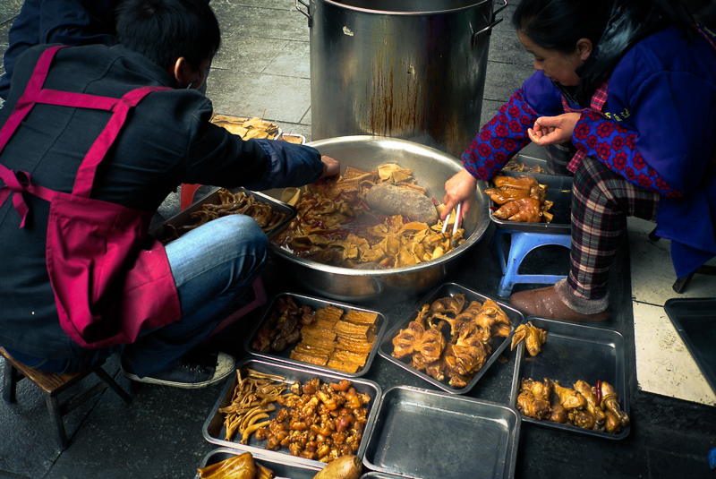
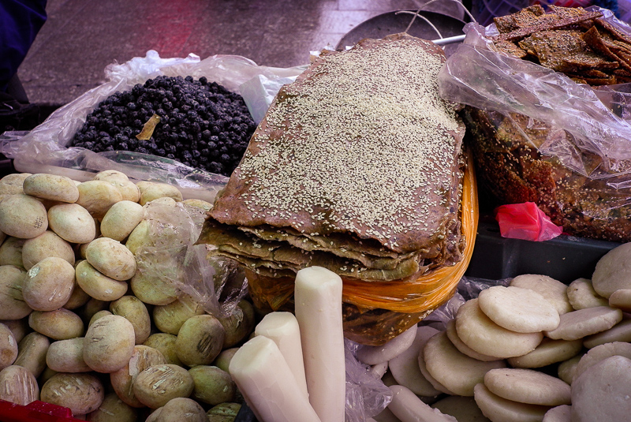
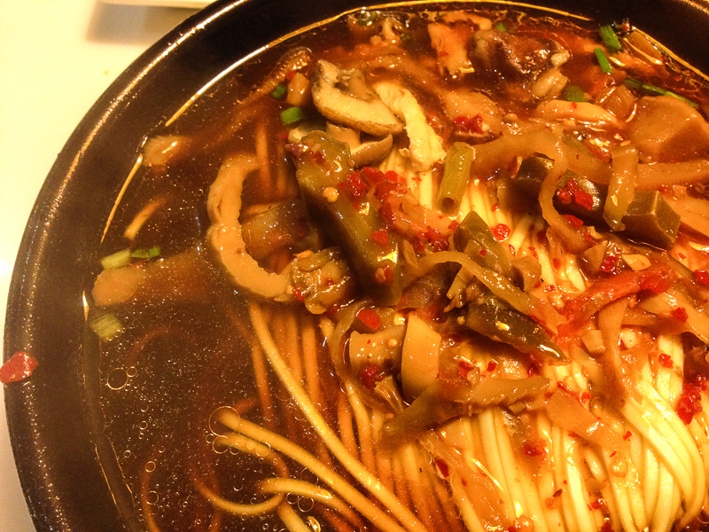

关于睡觉, 最悲催的事情莫过于平时上班的时候该起起不来, 周末不需要上班的时候竟然自己就醒了.

既然难得早起, 不如出去去吃个早餐.

说到早餐, 当然是豆浆油条小笼包. 美国的那些omelette咖啡等那叫Brunch.

开车出去, 路上了无行人.
我觉得一点也没有生活气息.

我记忆中的早餐时间是路上行人纷纷, 形色匆匆. 店铺开门, 热气腾腾.

在LA基本没有这种感觉.
 
前段时间在纽约出差倒是好些. 早起上班穿在行人中, 我感觉有一种活生生的力量向我铺面而来. 
这绝不是平时坐在车里能体会得到的.

如果生活有生命, 这大概就是ta的气息?  