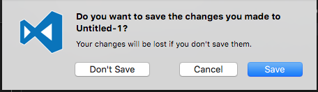
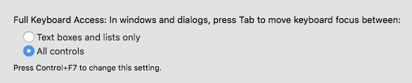
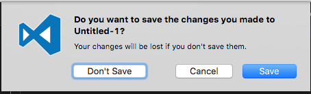

When closing an unsaved file in a code editor, for example Sublime or VS Code, you will see this dialog:

I know I can hit `ENTER` to save it, or hit `ESC` to cancel it, but how do I use keyboard to select "Don't Save"?

Here is the solution, go to `System Preference -> Keyboard -> Shortcuts` and check `All controls`:

Then you can use `SPACE` to select "Don't Save". (Notice the focus cue on the button)

