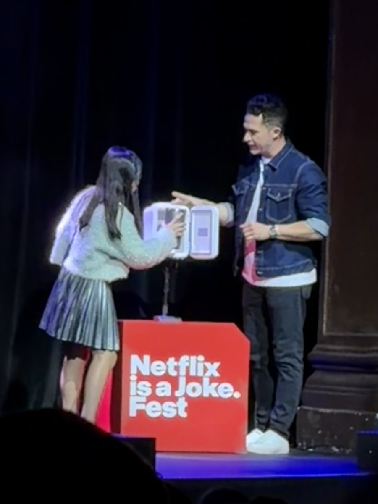

我还挺喜欢魔术的, 但是变不了 - 我没法大大方方得当着你的面“骗”你, 因为所有的魔术从某种程度上就是欺骗.

最近看过两场魔术秀：

1. Shin Lim

   他在Vegas演出。他的手法非常厉害，主要是以近景魔术为主。空手出牌，纸牌瞬间移动，信手拈来。虽然他和观众的互动不是那么多，但你还是会惊讶于他的专业水平。他在表演中主要讲述了自己变魔术的故事, 有意思的是，他的老婆也上台表演，虽然她的魔术没有任何手法纯道具哈哈。整场表演压轴魔术是他突然变到观众席之中，虽然这不是什么新鲜的idea，但是那一刻他就出现在我们左边不远位置的时候，那种震撼让我铭记于心。

2. Justin Willman

   昨天刚在LA看了他的演出。之前我看过他的 Netflix 节目，觉得挺好看的，发现最近有票就赶紧带家人去看了。他的表演以魔术和搞笑为主，种类非常丰富，包括意念魔术、记忆力魔术和时间魔术等。最关键的是他非常幽默，而且和观众互动特别多，几乎每个环节都会邀请台下观众一起完成魔术。昨天看得特别开心，笑得眼泪都出来了。他有个魔术是走到二楼（对，我们剧场有两层，他在楼下互动一通又跑上楼了）的观众席之中，顺便选一个观众拿出她的戒指，放到盒子里面，然后就消失了。奇怪的是，楼下有个贩卖糖果的那种投币的机器， 类似扭蛋那种，魔术师带着观众走到机器旁边，投了硬币，里面出来一个扭蛋，扭蛋里面就是她对戒指！ 这什么原理我百思不得其解… 遗憾的是他最后一个魔术和春晚那个计算机时间魔术很类似, 我们看过, 所以震撼度不够.

刘谦也是我喜欢的魔术师，看过好几个他的访谈包括和老罗的, 比较认同他的理念; 听说他的巡演也不错，有机会去看下。
