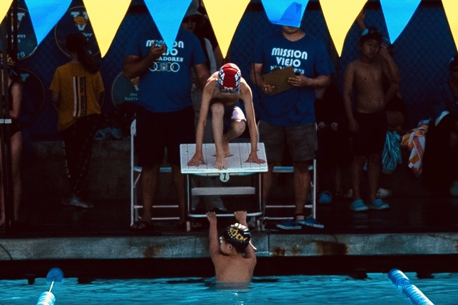

邦邦喜欢游泳。今天游泳训练回来的时候，我们跟他说，日本有个作家喜欢跑步，还写了一本书叫《当我跑步时，我在想什么》。

顺势问他：“你在游泳的时候，你在想什么？”

他先是扭扭捏捏，憋了半天，最后鼓起勇气，说了三件事：
1. 我怎么才可以游得更快？
2. 我怎么游得很慢。
3. 我想回家……

我们问他为什么想回家？他说他累。

多童真的分享啊。小孩不说谎——他想游得更好，又嫌自己不够好，到头来，他还是一个累了就想回家的孩子。