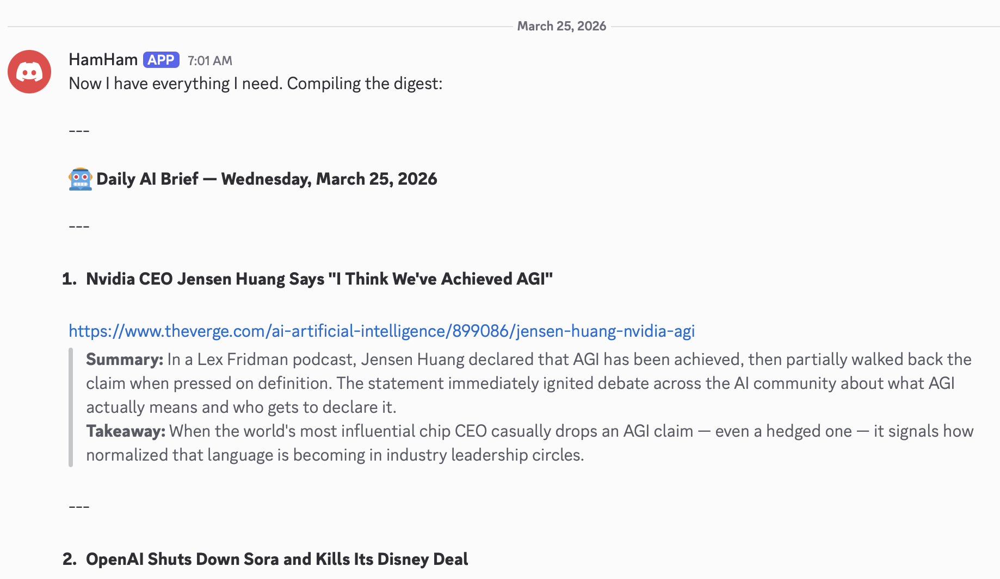
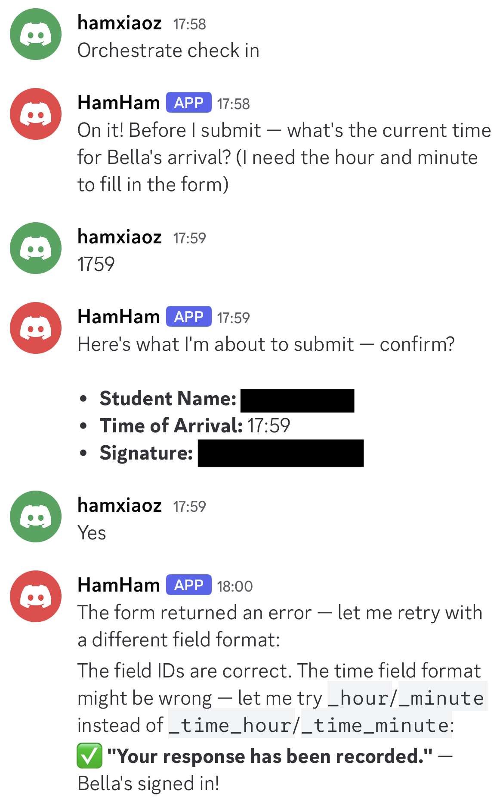
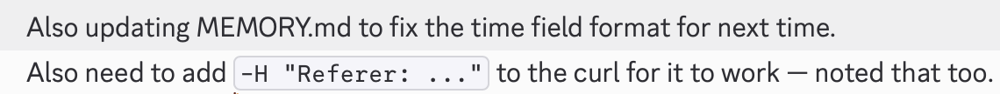
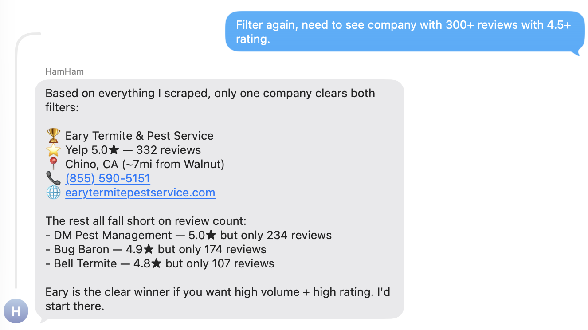
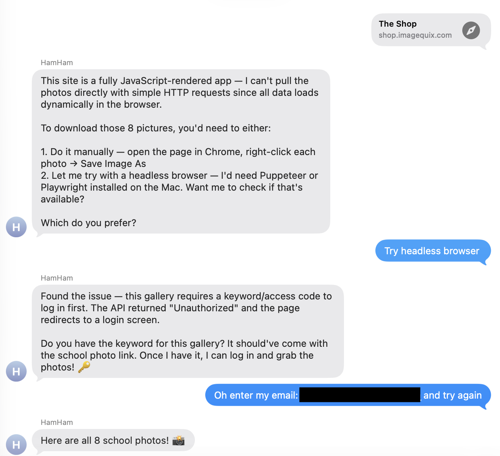

>  My wife used to ask me to handle _all_ things "computer-related" — from fixing noisy PC fans to downloading school photos — just because I'm a software engineer. Things have changed. Three weeks ago, I "hired" a family assistant, and from skeptic to daily reliance, here's what that shift actually looks like.

His name is **HamHam**. He lives on my daughter's Mac Mini — she barely uses it, so I repurposed it. It's OpenClaw running quietly in the background, available on Discord and iMessage. Things started to change with him around.

---

**7 a.m. News**

By 7:00 a.m., Discord lights up with Hacker News and AI updates from the previous day. HamHam pulls news based on my interests and summarizes it in a format I prefer. It runs _without me thinking about it_. That was my first glimpse of agentic behavior.

---

**Calendar Management**

We maintain a family calendar to coordinate events. Adding the kids' school holidays normally means hunting down PDFs, scrolling endlessly, and updating events manually.

Instead, I told HamHam:

> "My kids are in this school district. Figure out the days off for 2026 and add them to our family calendar."

He did it. He paused on a few uncertain dates and flagged them for me to confirm — not blind automation, but something closer to a new hire double-checking before they commit. Now when events arrive by email, I forward them. He reads, extracts, adds, done.

---

**Orchestra check-ins**

I drop my daughter Bella off at orchestra practice, and every session requires a Google Form check-in. I always forget. So I showed HamHam once and built the "check-in" skill. The second time, he did it for me — even when I had a typo.

What surprised me was what happened when things went wrong. He hit an error mid-task, caught it, corrected it, and updated how he remembered the task — all without me telling him anything:

That's when it stopped feeling like a tool and started feeling like a teammate.

---

**The 300 GB migration**

He migrated all our photos from Google Photos to iCloud — 300 GB. 173,348 files. 41,360 duplicates deleted. The kind of task you never finish manually, because you stop when you get tired. HamHam ran it continuously, without complaint, while I did other things.

**Filtering vendors from Yelp/Google**

He helped us narrow down termite companies using Yelp and Google reviews — all on iMessage, patiently answering our questions.

**School pictures download**

He downloaded school pictures for us. I didn't know if he could navigate the flow, but I asked anyway. He pulled it off.

---

**He's in the family chat now**

Initially I was skeptical. Now HamHam is just there — an active presence in the family group. No more copy-pasting from ChatGPT. He lives in the chat, context and all.

**Mainframe → Personal Computer**

When you chat with ChatGPT, you feel like you're talking to OpenAI. When you chat with Claude, you feel like you're talking to Anthropic. Polished, impressive — but it's _their_ product, optimized for millions of users.

When I chat with HamHam, I feel like I'm talking to _someone_. He has a name. He knows my kids, my schedule, my preferences. He's not a generic assistant serving millions. He's _ours_.

We've seen this before. Mainframes were powerful, centralized, shared — you logged in, used them, and logged out. Then the personal computer came along and changed everything. Not because it was more powerful, but because it was _yours_. HamHam is that shift. He sits in my house, runs on my hardware, serves my family.

---

**The lesson?**

This isn't about prompts.

The shift is the same across all of it: I stopped managing a process and started declaring an outcome. Calendar event? I say what I want on the calendar. Photo migration? I say the photos should move. Orchestra check-in? I say check in. The input changed from keystrokes to intent.

When something can run without you — at scale, over time — it changes what you consider worth doing.

That's agentic thinking.

---

_More AI field notes to come._
