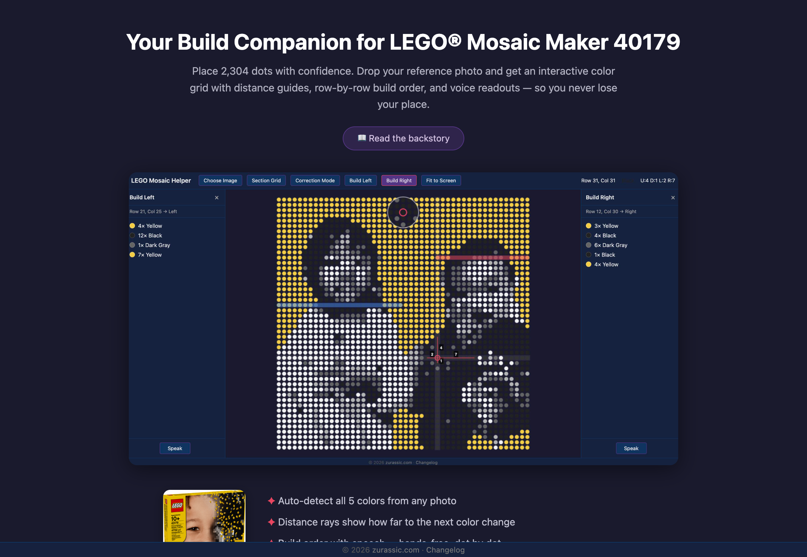
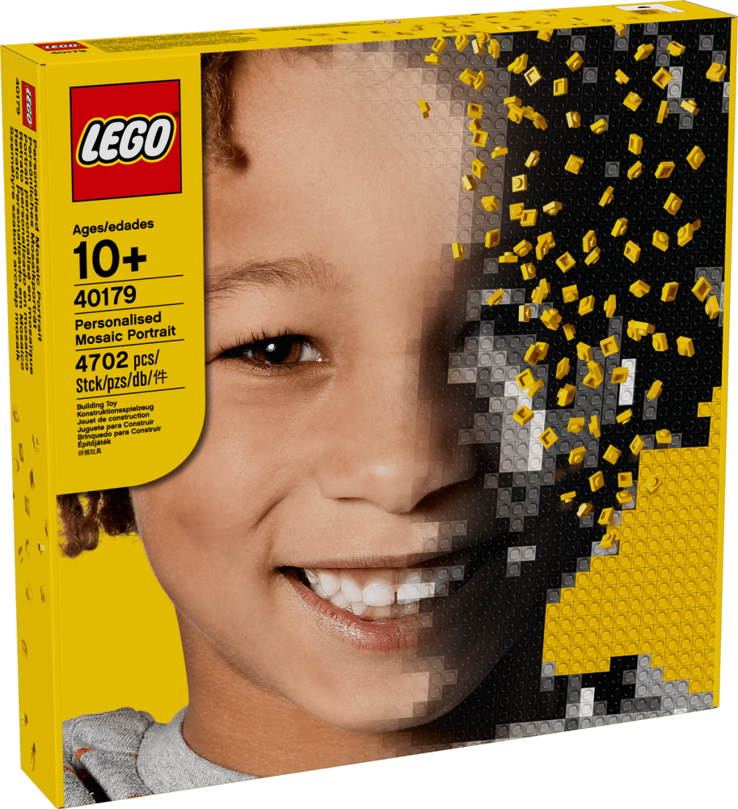
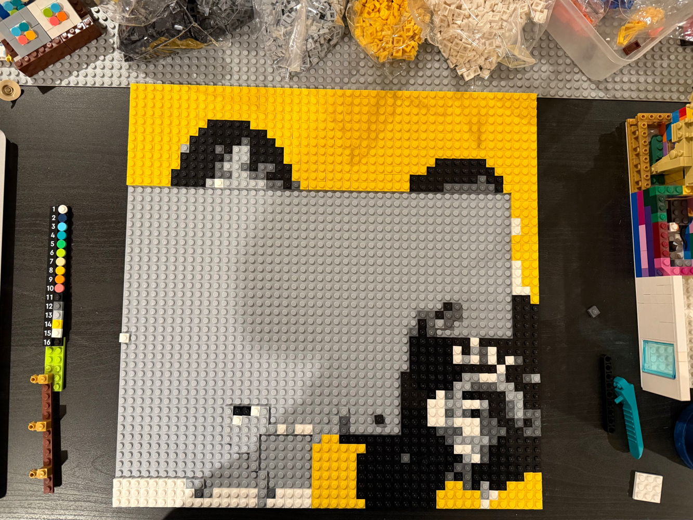
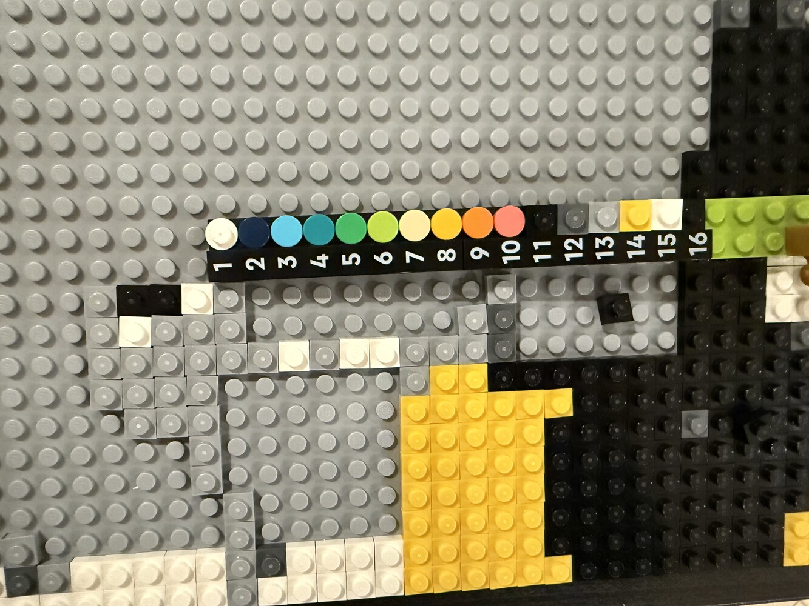
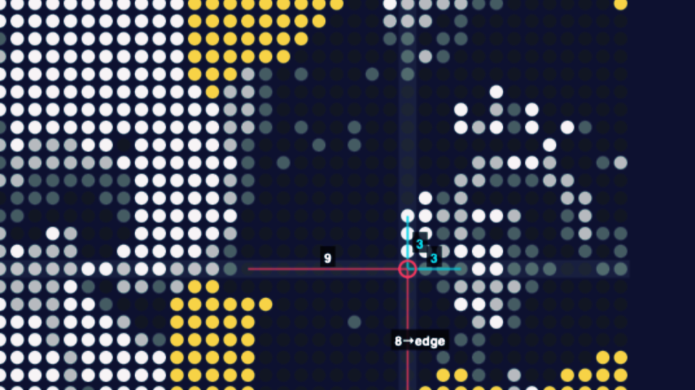
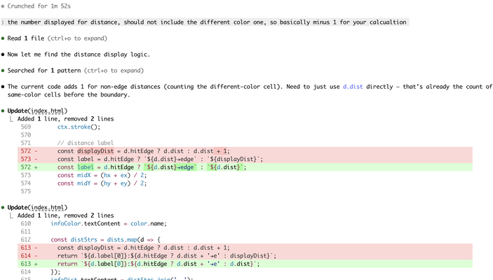
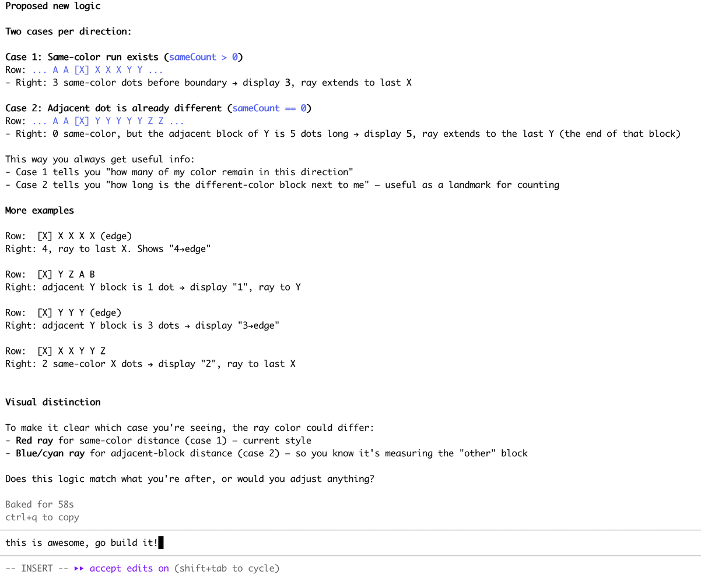



<figure>
  
  <figcaption>The Lego Mosaic Helper, showing distances to the nearest reference dots.</figcaption>
</figure>

Building Lego is one of the ways I decompress on weekends. This weekend, we finally opened the LEGO Mosaic Maker — a birthday gift for my son.

<figure>
  
  <figcaption>LEGO Mosaic Maker</figcaption>
</figure>

We picked a photo of my kids and started converting it into a 48×48 mosaic. This is what it would look like once it's done.

<figure>
  
  <figcaption>What it would look like once it's done.</figcaption>
</figure>

Sounds simple: Place pieces one by one.

Until you realize that's **2,304** placements.

And unlike structured Lego builds, there are no obvious reference points.

It's easy to drift off by one square — and suddenly your entire row is wrong. This is what it looked like in progress.

<figure>
  
  <figcaption>What it looked like in progress.</figcaption>
</figure>

We started by counting pieces manually. 

Double checking. 

Recounting.

My son even built a small "ruler" tool out of Lego so we could measure distance across the board.

<figure>
  
  <figcaption>Creative. But inefficient.</figcaption>
</figure>

Creative. But inefficient.

> I kept thinking: there has to be a better way.

Then I thought I can use AI to build a helper for us.

After a few prompts with Claude, I had a simple overlay tool that could:

- Detect grid positions
- Show distances
- Help anchor reference points

<figure>
  
  <figcaption>Version 1: detect grid positions, show distances, anchor reference points.</figcaption>
</figure>

It worked — but not perfectly. When I hover on a special dot that it won't show the distance, which is not what I want; Also I'd like the distance count without the dot I'm in because that's how I would count the dots when building the Lego.

> Again, in the era of AI, we can customize the tool to whatever we want.

So I went ahead and iterated couple of times. Version 2 improved it. Version 3 felt right.

<figure>
  
  <figcaption>Version 2: fixing the distance label logic with Claude Code.</figcaption>
</figure>

<figure>
  
  <figcaption>Version 3: the logic that finally felt right.</figcaption>
</figure>

---

What I liked most wasn't the tool.

It was the loop:

Observe friction → Co-Design with AI → Test → Refine → Deliver.

AI didn't replace effort, it accelerated iteration.

---

Applied AI, for me, isn't about building flashy demos.

It's about spotting everyday friction — and asking:

> "Can I automate this? Can I build a tool to solve the problem?"

I'm so excited, because I feel that the only real limit is the ideas, the imagination, and the courage to make things better.

---

This is part of my series of "Applied AI Field Notes" - a collection of articles on how I use AI in personal and professional life.

- **Applied AI Field Notes 001 - Lego Mosaic Helper** (you're reading it)
- [Applied AI Field Notes 002 - Family Assistant with OpenClaw](/writing/ai/applied-ai-field-notes-002-family-assistant/)
- [Applied AI Field Notes 003 - My Standing Desk Has an API Now](/writing/ai/applied-ai-field-notes-003-standing-desk-api/)
- [Applied AI Field Notes 004 - My Best Customer Is 9 Years Old](/writing/ai/applied-ai-field-notes-004-my-best-customer-is-9-years-old/)

_More AI field notes to come._
