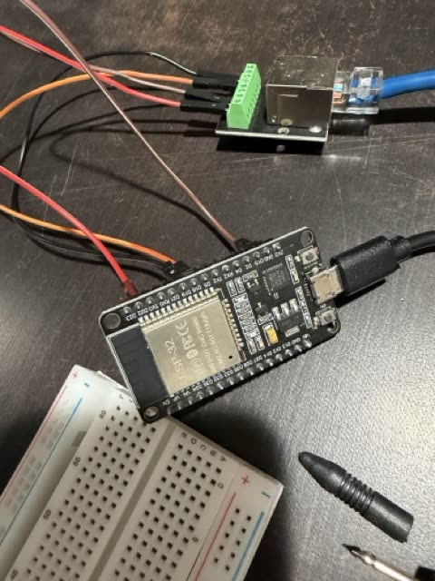
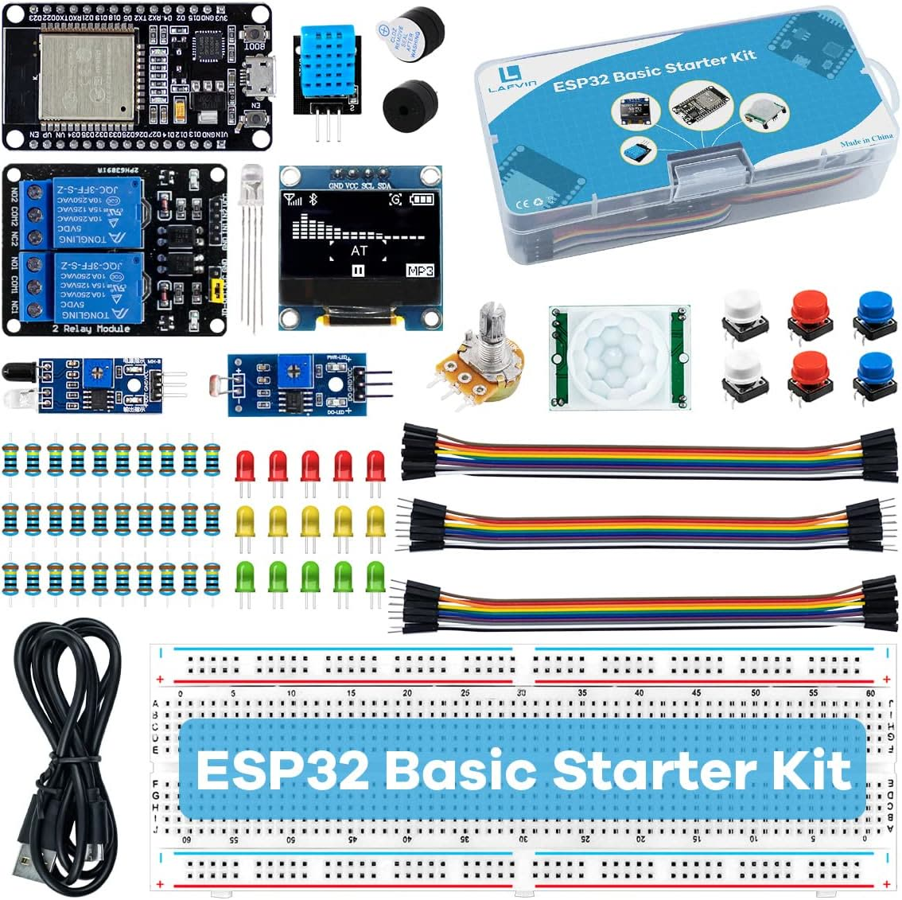
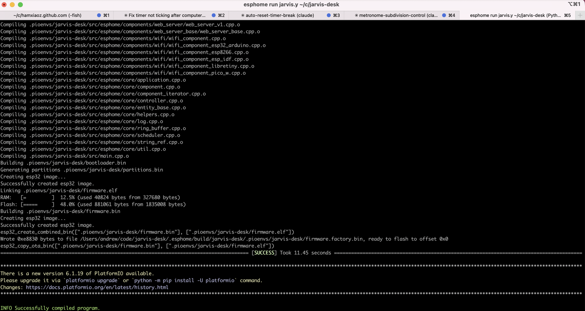
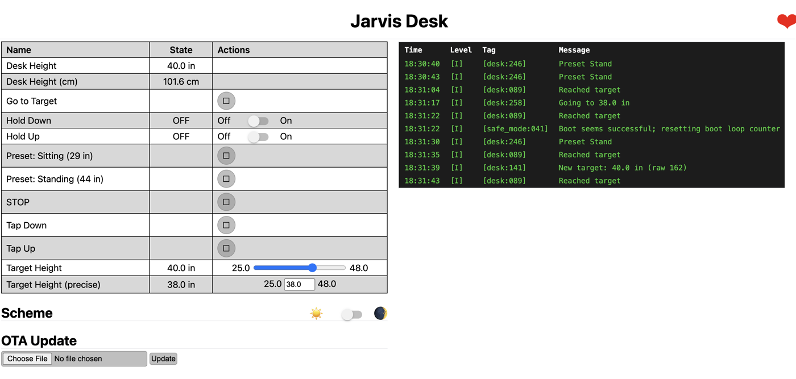

I almost spent $1,000 to give my standing desk an API.

Instead, I hacked it with the help of Claude.

Total cost: $25, two Sundays and a much better understanding of the thing I sit at every day.



The trigger was a Mac app I'm building that nudges me when I've been sitting too long (more to come in future AI field notes). Fine, but a notification I can dismiss isn't really a nudge. What if the desk just *moved*?

My first instinct was to throw money at it. IKEA Idåsen has Bluetooth and a documented protocol. Ergodriven has some AI-driven controller. A few other "smart" frames in the $800–1,000 range. I was a button away from checkout when I caught myself: I already own a Jarvis standing desk bought 11 years ago. Heavy frame, dual motors, still works perfectly. The only thing missing is the part where it talks to my computer.

So I went the other way with the help from Claude. ESP32 microcontroller, two RJ-45 breakouts, jumper wires, a couple of short ethernet cables. ~$25 on Amazon.




The plan: splice into the cable between the desk's control box and its handset, listen to what they say to each other, and learn to speak the same language.

The plan was clean. Reality was not.

**Bump #1: every button moved the desk down.**

I assumed Jiecang-based desks (Jarvis, Uplift, Desky all share the same OEM) used standard UART serial. I wired it up, flashed firmware, hit "Up" — desk went down. Hit "Stop" — desk went down. Unplugged the ESP32 entirely — the desk kept going down for 2 seconds!




The multimeter solved it. I held down the Up button on the physical handset and probed each terminal one by one. Terminal 7 dropped to 0V. Released, it went back to 5V. Did the same for Down — terminal 8. That's how the handset talks to the controller: not serial data, just "pull this wire to ground." Two completely different protocols on the same cable — UART for reading height out, bare wire-to-ground for sending button presses in.


The reason everything moved down was that the line I was driving happened to be terminal 8, the Down line, held low at boot by default.
Once I knew which terminals were which, I wired them to GPIO18 and GPIO19 on the ESP32, configured as open-drain outputs. Pull low = button pressed. Release = button up. Exactly what the physical handset does.

**Bump #2: the silent UART.**

Once buttons worked, I needed height. This took three rounds.

First I wired the data line to the ESP32's default `RX` pin. Zero bytes. Not noise — silence. I moved the wire to a different GPIO and wired it as the simplest possible sensor: just watch the pin go high and low. Moved the desk. The pin went crazy. Signal was physically there, the hardware UART just wasn't decoding it.

So I bypassed the library entirely and polled the raw buffer every 200ms. Out came:

```c
01 01 01 CD
01 01 01 CE
01 01 01 D0
```

Last byte ticking up as the desk rose. Now I had signal. I just needed meaning.

I taped two measurements: lowest position (25 in, raw value 12), highest (48 in, raw value 242). The math fell out cleanly:

```c
23 inches ÷ 230 counts = 0.1 inches per count`
```

The desk was already thinking in tenths of an inch.

Final formula:

```c
inches = raw × 0.1 + 23.8
```

Moved the desk. Dashboard tracked the tape measure perfectly.


**Where it ended up:**

A web dashboard at `jarvis-desk.local`. Live height readout. Sit/stand presets.



An HTTP API.


**A few things I noticed:**

**1. AI compressed the learning curve dramatically.**

Months ago I didn't own a multimeter. This weekend I was decoding UART frames and reasoning about GPIO behavior. AI was the hardware mentor I never had — explaining voltages, sanity-checking wiring, translating scattered forum posts into something actionable.

**2. The internet is full of *partial* solutions.**

I found three different ESPHome projects for "Jiecang desks." None worked for my exact hardware. Each one moved me forward by one step. The skill isn't finding the right project — it's treating everything as a clue.

**3. A multimeter is `console.log` for hardware.**

Most of my debug time was answering "is the signal actually getting there?" Same instinct as software. Different probe.

**3. The cheap path taught me more than the expensive path would have.**

If I'd bought the Idåsen, I'd have a working app and zero understanding of how desks like this work. Instead I now know the protocol byte-for-byte, and I could do this for any Jiecang-based frame in an afternoon. That's worth more than the $975 I didn't spend. It reminded me of Learn Python the Hard Way — turns out the hard way is the shortcut.


I open sourced the code at [Jarvis Desk WiFi Controller](https://github.com/hamxiaoz/jarvis-desk-controller)

AI is making all the "hacking" fun again. All you need is curiosity and patience.

---

This is part of my series of "Applied AI Field Notes" - a collection of articles on how I use AI in personal and professional life.

- Applied AI Field Notes 001 - Lego Mosaic Helper
- Applied AI Field Notes 002 - Family Assistant with OpenClaw
- Applied AI FIeld Notes 003 — My Standing Desk Has an API Now

_More AI field notes to come._
