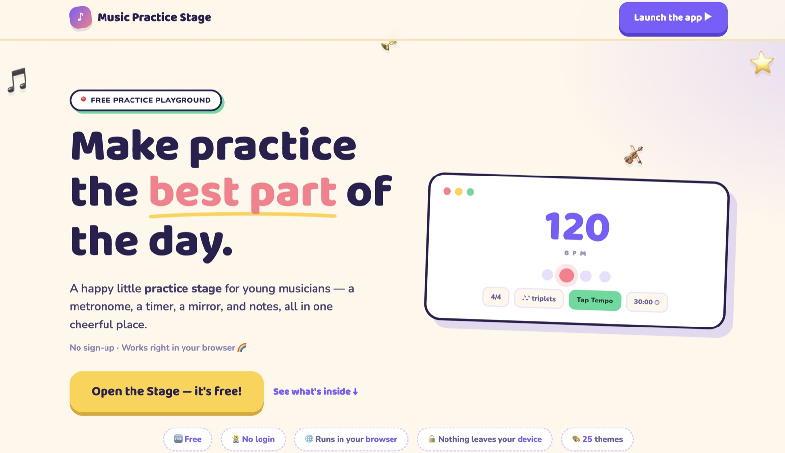
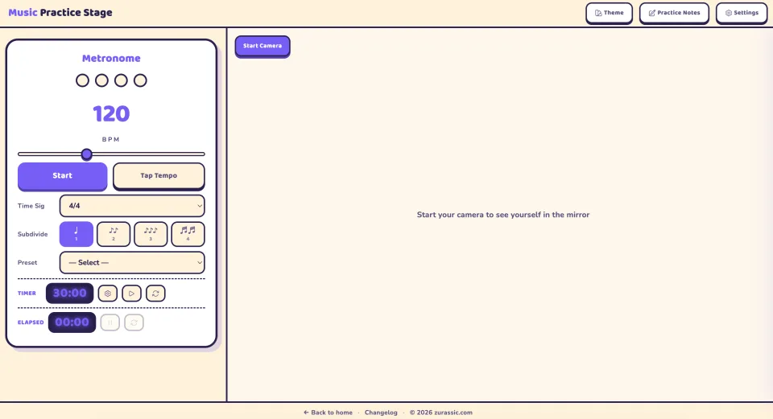
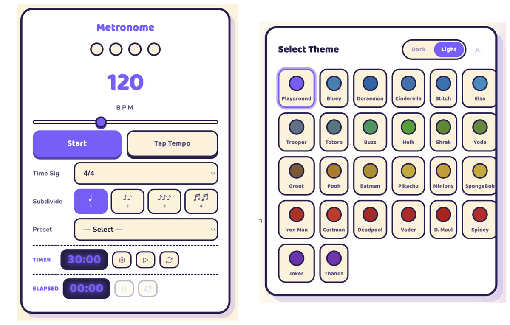
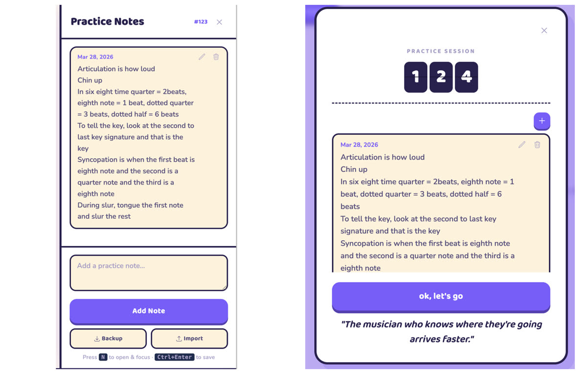



<figure>
  
  <figcaption>Music Practice Stage</figcaption>
</figure>

Tick. Tick. Tick. The metronome holds the beat. Over it, a clarinet works through "The Blue Danube Waltz" — mostly right, a squeak on the high note from time to time. Not perfect, I know, but I can hear my son practicing — hear him chasing the rhythm.

"Daddy, can you help here?"

"Yeah."

"Can you add nine-eight?"

"What's nine-eight?"

He explains it like I'm the student. Nine-eight — 9/8 time. Nine eighth-notes to a measure, felt in three groups of three. His teacher asked him to practice that, and the practice tool I built him didn't have that time signature yet. He needs the metronome to click it for him.

"Okay. Give me five minutes."

I open Claude Code. Plan, implement, test, deploy via Vercel. Five minutes later, the new time signature is live.

"Done."

He refreshes the browser and goes back to playing.

---

## The customer feedback is instant

That loop — he asks, I build, I ship, he keeps practicing — I've felt it before.

Years ago I built [Windows software](https://www.youtube.com/watch?v=tyyQgcu2kXI) at AEM — race car tuning software for engines on a dyno. A tuner stands on the throttle, the RPMs sweep up, and the air/fuel ratio has to draw on screen the instant it happens. Any lag and you're tuning blind. That meant low-level USB drivers, game-style live traces, and hand-rolled GDI painting (anyone else remember sweating over Win32 WM_PAINT messages?) — all so the tuner saw the engine respond the moment they stepped on the gas. But the part I remember most isn't the code — it's the forum. I talked to customers there every day. I could watch their excitement, read their feedback at night, and ship it in the next morning's release.

This little project handed that loop back to me. My customer is my 9-year-old son. He sits ten feet away. And he is brutally honest.

## The requests come from across the room

The things a young musician needs are normally scattered — a metronome app here, a timer there, a mirror, a notebook. I pulled them into one cheerful place, then shaped each one to him.

<figure>
  
  <figcaption>Everything in one cheerful place: metronome, timer, mirror, and notes.</figcaption>
</figure>

- **A metronome** — He kept borrowing my phone for one, and I kept wanting my phone back. So I built one into the app.
- **A mirror** — His teacher wanted him to watch his cheeks while he played. Before buying a mirror, I realized the laptop already had a camera. I also built an experiment feature to use AI to detect cheek but it's not stable yet.
- **Practice Notes** — His teacher always leaves him a few things to work on. We wanted him to read those notes before every practice session, so whenever he starts the timer, the notes appear first.
- **Streaks** — Practicing every day is a lot to ask of a 9-year-old. A little streak counter turns it into a game. Every day he practices, the number goes up, and maybe, just maybe, he'll want to keep the streak alive.
- **Themes** — I believe the AI era should be an era of abundance. So I built twenty-five themes, with plenty of blue, because that's his favorite color.
- **Timer + Elapsed Time** — He practices against a timer, but he'd pause it and lose track of how long he'd actually played. So I added a separate elapsed-time counter that keeps running regardless of pauses.
- **9/8 Time** — The feature request that started this story.

<figure>
  
  <figcaption>Metronome and theme picker</figcaption>
</figure>

<figure>
  
  <figcaption>Practice notes and session view</figcaption>
</figure>

## Customization will be the default

Chris Anderson wrote about the shift from mass markets to niches in "The Long Tail". AI pushes that idea one step further: from niches to individuals.

For decades, software has been built for averages. If enough people wanted a feature, maybe it made the roadmap. If only one person needed it, the answer was usually “no”.

AI changes that equation. In the AI era, customization isn't the premium tier anymore — it's the default.

My son is my customer. He's the best one I've ever had.

---

P.S. 

This app started back in early February, and I'll admit a lot of it was vibe coding. Back then, "agentic programming" and "loops" weren't really a thing yet — so it's a funny coincidence that Andrew Ng just wrote an [article about the loops](https://www.deeplearning.ai/the-batch/issue-359) that drive AI product building. In the same piece, he mentions building a typing app for his daughter over a weekend. He built for his daughter; I built for my son.

<figure>
  
  <figcaption>Andrew Ng's three development loops. Source: Andrew Ng, <a href="https://www.deeplearning.ai/the-batch/issue-359">The Batch #359</a>.</figcaption>
</figure>

Ng describes three loops. The outermost — the "external feedback loop," where you put the product in front of real users — is normally the slowest, "rarely taking less than hours and sometimes taking days or even weeks." Mine runs in minutes, because my user is sitting right next to me. The loop everyone else measures in days, I measure in the time it takes him to refresh the browser.

<!--Finally, I'm launching the app on Product Hunt — try it with your own kids, or fork it and make it theirs.

<figure>
  
  <figcaption>Caption here.</figcaption>
</figure>-->

---

This is part of my series of "Applied AI Field Notes" - a collection of articles on how I use AI in personal and professional life.

- [Applied AI Field Notes 001 - Lego Mosaic Helper](/writing/ai/applied-ai-field-notes-001-lego-mosaic-helper/)
- [Applied AI Field Notes 002 - Family Assistant with OpenClaw](/writing/ai/applied-ai-field-notes-002-family-assistant/)
- [Applied AI Field Notes 003 - My Standing Desk Has an API Now](/writing/ai/applied-ai-field-notes-003-standing-desk-api/)
- **Applied AI Field Notes 004 - My Best Customer Is 9 Years Old** (you're reading it)

_More AI field notes to come._
